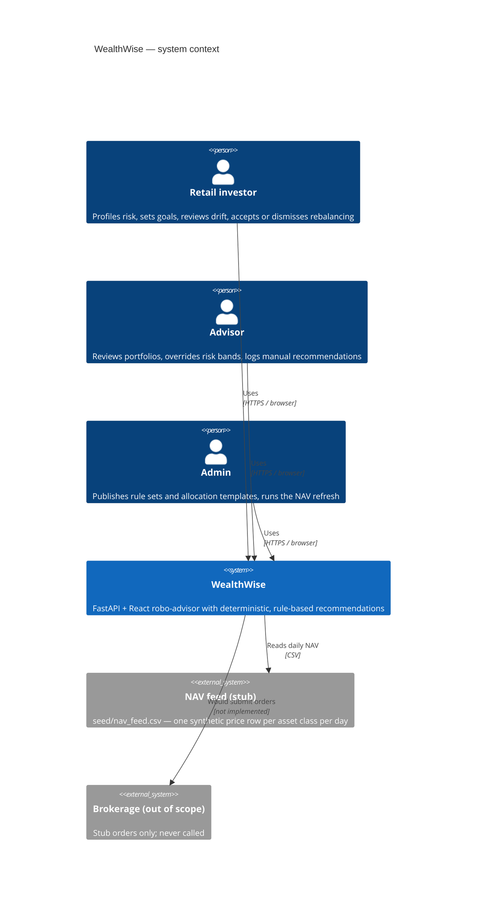
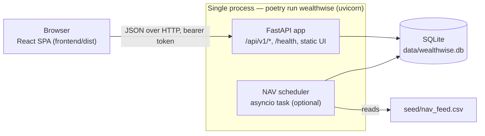
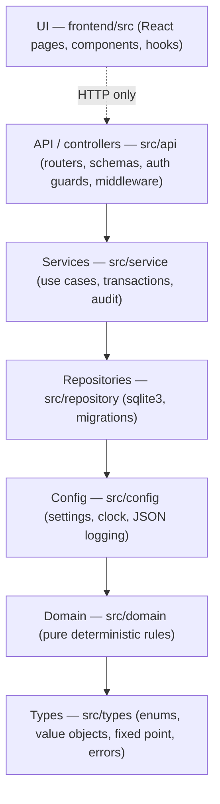
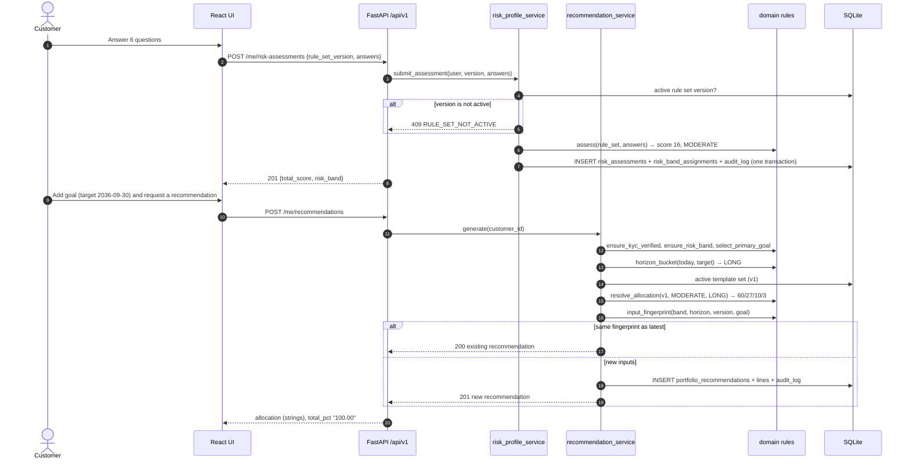
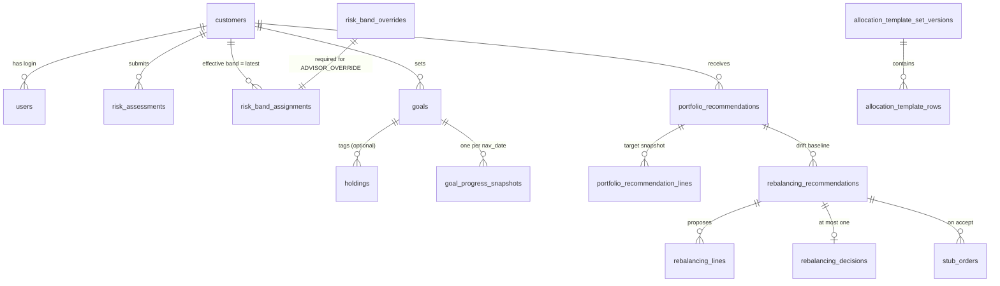

# WealthWise — Architecture

## 1. System context (C4 level 1)


## 2. Containers (C4 level 2)


## 3. Layered structure (enforced)


| Layer | Package | Responsibility | Enforcement |
|---|---|---|---|
| Controllers | `src/api` | HTTP, validation, **authentication boundary** (`require_role`) | May not import `src.repository` (import-linter). Every non-public route is guarded (`test_routes_have_auth.py`). |
| Services | `src/service` | Orchestration, one transaction per use case, audit writes | No `fastapi` or `sqlite3` imports |
| Repositories | `src/repository` | The only `sqlite3` user. Scaled-integer storage. Append-only tables expose inserts only. | import-linter `forbidden` contracts |
| Domain | `src/domain` | Scoring, horizon, templates, drift, quantities, progress, overrides, versioning | No `logging`, `random`, `os` or I/O. No float (AST test and hook). |
| Types | `src/types` | Enums, `Decimal` helpers, records | Imports nothing internal |

## 4. Risk profile → recommendation (sequence)


## 5. Daily NAV refresh (sequence)
```mermaid
sequenceDiagram
    participant S as scheduler / POST /admin/nav/refresh
    participant N as nav_service
    participant G as goal_progress_service
    participant R as rebalancing_service
    participant DB as SQLite
    S->>N: run_refresh_cycle()
    N->>DB: BEGIN
    N->>DB: INSERT nav_prices (next feed date; CASH = 1.0000)
    N->>G: snapshot_all(nav_date)
    G->>DB: INSERT OR IGNORE goal_progress_snapshots (one per goal per date)
    N->>R: evaluate_all()
    loop each KYC-verified customer with holdings and a recommendation
        R->>DB: SUPERSEDE open proposals
        R->>R: drift > threshold? → propose BUY/SELL
        R->>DB: INSERT rebalancing_recommendations + lines + audit_log
    end
    N->>DB: COMMIT
```

## 6. Data model (main tables)

**Append-only** (UPDATE and DELETE triggers abort): assessments, assignments, overrides, recommendations and lines, NAV prices, snapshots, rebalancing proposals, lines, decisions and stub orders, manual recommendations, `audit_log`, `schema_migrations`. **Immutable once published:** rule-set and template versions and their rows.

## 7. Cross-cutting decisions
| Concern | Decision | Why |
|---|---|---|
| Fixed point (NFR-01) | `Decimal` in Python. Integers in SQLite (paise, bp, ×10⁴). Strings on the wire. Basis points in JS. | Exact sums (100.00) and reproducible rounding |
| Determinism | Injected `Clock`. No randomness in the domain. Input fingerprints. | The same inputs always produce the same advice |
| Auth (NFR-04) | Stub PBKDF2 users with opaque bearer tokens. One role per user. | Real identity is out of scope, but role separation is required |
| Logging (NFR-03, NFR-06) | JSON lines with `correlation_id`. A denylist drops PII and balance keys. | Observability without leaking customer data |
| Migrations (NFR-05) | Numbered SQL, checksummed. The runner refuses to start if an applied file changed. | Tamper-evident schema history |
| Single command | `poetry run wealthwise` builds the UI if needed and serves API + UI on :8000 | One origin, no CORS, simple local deployment |
